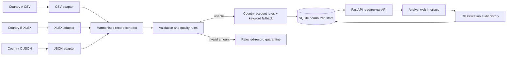
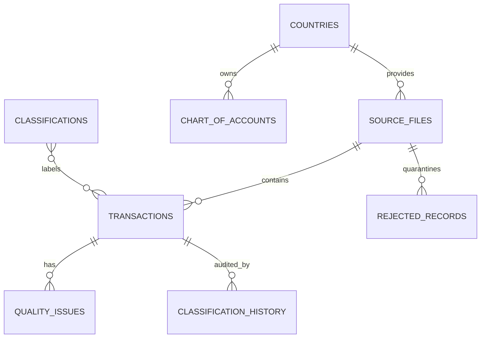

# Prototype architecture and design notes

## Boundaries and responsibilities

- Country adapters own source-specific field names, date/number parsing and nested-record handling. They emit the same `HarmonizedRecord` contract.
- Validation emits coded issues. Records without a usable amount are quarantined; recoverable defects remain queryable with their issues.
- Classification is configuration-driven. Exact country/account rules take priority; conservative text fallback is review-only. No model silently forces an unknown record into a class.
- SQLite stores reference data, source-file checksums and metadata, country charts of accounts, harmonised facts, quality issues, rejected records and analyst decision history.
- The API exposes filtered review data and validates classification overrides against the supplied references.

## Data model

The amount is deliberately stored only in its original currency. Cross-currency totals are not valid without a dated, governed exchange-rate source, so the UI groups totals by currency.

## Adding another country

1. Add the country to `ref_countries.csv` (or a managed reference source in production).
2. Implement one adapter returning `HarmonizedRecord` objects.
3. Register its source in `pipeline.py`.
4. Add reviewed account rules in `config/classification_rules.json`.
5. Add representative adapter, malformed-input and reconciliation tests.

The database, classifier, API and UI do not need country-specific changes.

